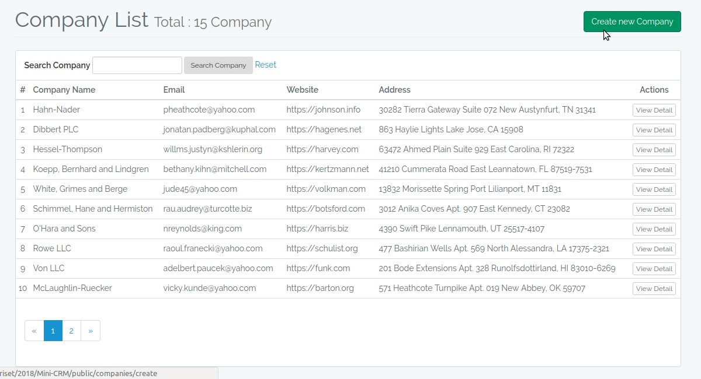
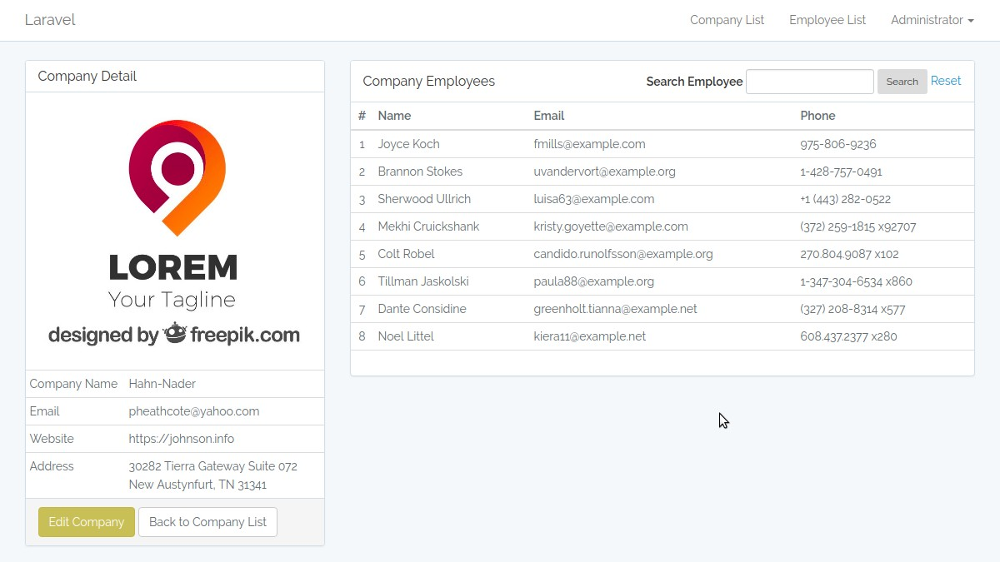
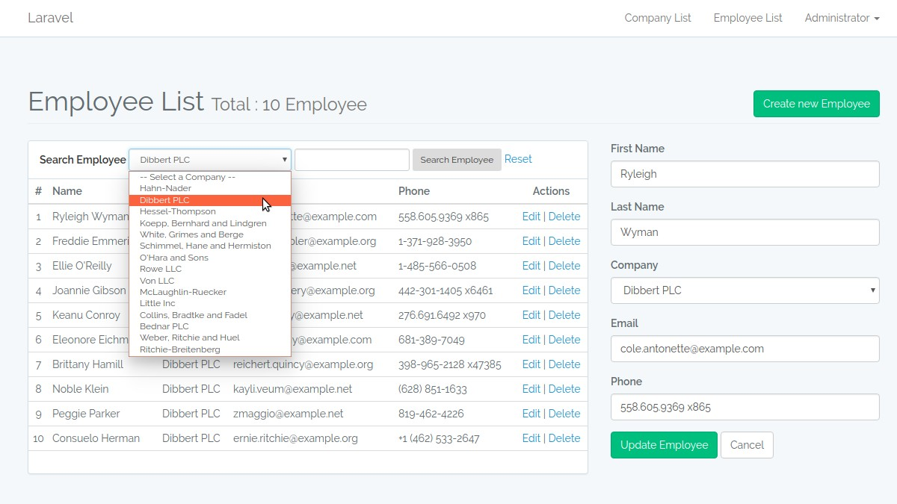
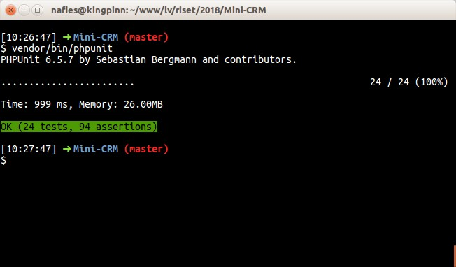

# Mini-CRM

This project comes from Laravel Daily blog post, [How to Test Junior Laravel Developer Skills: Sample Project](http://laraveldaily.com/test-junior-laravel-developer-sample-project), a challenge (sample project) for junior laravel developer.

This project built with Laravel 5.5.

## User Requirements

* [x] Basic Laravel Auth: ability to log in as administrator
* [x] Use database seeds to create first user with email admin@admin.com and password “password”
* [x] CRUD functionality (Create / Read / Update / Delete) for two menu items: Companies and Employees.
* [x] Companies DB table consists of these fields: Name (required), email, logo (minimum 100×100), website
* [x] Employees DB table consists of these fields: First name (required), last name (required), Company (foreign key to Companies), email, phone
* [x] Use database migrations to create those schemas above
* [x] Store companies logos in storage/app/public folder and make them accessible from public
* [x] Use basic Laravel resource controllers with default methods – index, create, store etc.
* [x] Use Laravel’s validation function, using Request classes
* [x] Use Laravel’s pagination for showing Companies/Employees list, 10 entries per page
* [x] Use Laravel make:auth as default Bootstrap-based design theme, but remove ability to register

### Extra Tasks

* [ ] Use Datatables.net library to show table – with our without server-side rendering
* [ ] Use more complicated front-end theme like AdminLTE
* [ ] Email notification: send email whenever new company is entered (use Mailgun or Mailtrap)
* [x] Make the project multi-language (using resources/lang folder)
* [x] Basic testing with phpunit (I know some would argue it should be the basics, but I disagree)

## How to Install

1. Clone the repo : `git clone https://github.com/nafiesl/Mini-CRM.git`
2. `$ cd Mini-CRM`
3. `$ composer install`
4. `$ cp .env.example .env`
5. `$ php artisan key:generate`
6. Create **database on MySQL** or **SQLite**
7. **Set database credentials** on `.env` file
8. `$ php artisan migrate --seed`
9. `$ php artisan storage:link`
10. `$ php artisan serve`
11. Login with :
    - email : `admin@admin.com`
    - password : `password`

#### Demo Records

If you want to some demo records, we can use **Laravel Tinker** and **Model Factories**.

```bash

$ php artisan tinker
>>> factory(App\Company::class, 15)->create(['creator_id' => 1])->each(function ($u) { $u->employees()->saveMany(factory(App\Employee::class, rand(5, 12))->make(['company_id' => $u->id])); });
```

Then we will get some filled records like screenshots below (except the company logo).

## Screenshots

#### Company List


#### Company Detail


#### Employee List


#### Test Suites


## License

This software is open-sourced software licensed under the [MIT license](LICENSE).
